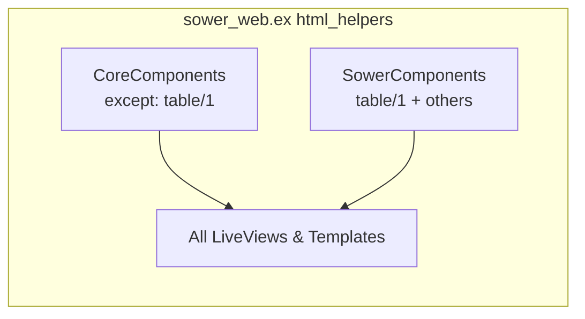

# Design: Mobile-Responsive Table

## Overview

Add a `table/1` component to `sower_components.ex` that forks core `.table` with a `hide_on={:mobile}` attr on `:col` slots. Columns marked `hide_on={:mobile}` get `hidden sm:table-cell` on both `<th>` and `<td>`. Migrate all 9 `.table` instances, then move SowerComponents import into `html_helpers` to shadow CoreComponents.table globally.

## Architecture



No new modules. One new function in an existing module. Import wiring change in `sower_web.ex`.

## Component Design

### New `table/1` in SowerComponents

Identical to core `.table` except:
1. `:col` slot gains `attr :hide_on, :atom, values: [:mobile, nil]`
2. `<th>` and `<td>` conditionally add `hidden sm:table-cell` classes
3. Outer container uses `overflow-x-auto` instead of `overflow-y-auto`
4. Table width: `w-full mt-11` (drops the `w-[40rem]` fixed width)

**Attributes** (unchanged from core):

| Attr | Type | Required | Default |
|------|------|----------|---------|
| id | :string | yes | — |
| rows | :list | yes | — |
| row_id | :any | no | nil |
| row_click | :any | no | nil |
| row_item | :any | no | &Function.identity/1 |

**Slots**:

| Slot | Required | Attrs |
|------|----------|-------|
| :col | yes | label: :string, hide_on: :atom |
| :action | no | — |

### HEEx Template

```heex
<div class="overflow-x-auto px-4 sm:overflow-visible sm:px-0">
  <table class="w-full mt-11">
    <thead class="text-sm text-left leading-6 text-zinc-500 dark:text-zinc-400">
      <tr>
        <th
          :for={col <- @col}
          class={["p-0 pr-6 pb-4 font-normal", col[:hide_on] == :mobile && "hidden sm:table-cell"]}
        >
          {col[:label]}
        </th>
        <th :if={@action != []} class="relative p-0 pb-4">
          <span class="sr-only">{gettext("Actions")}</span>
        </th>
      </tr>
    </thead>
    <tbody
      id={@id}
      phx-update={match?(%Phoenix.LiveView.LiveStream{}, @rows) && "stream"}
      class="relative divide-y divide-zinc-100 dark:divide-zinc-700 border-t border-zinc-200 dark:border-zinc-700 text-sm leading-6"
    >
      <tr
        :for={row <- @rows}
        id={@row_id && @row_id.(row)}
        class="group hover:bg-zinc-50 dark:hover:bg-zinc-800"
      >
        <td
          :for={{col, i} <- Enum.with_index(@col)}
          phx-click={@row_click && @row_click.(row)}
          class={[
            "relative p-0",
            @row_click && "hover:cursor-pointer",
            col[:hide_on] == :mobile && "hidden sm:table-cell"
          ]}
        >
          <div class="block py-4 pr-6">
            <span class="absolute -inset-y-px right-0 -left-4 group-hover:bg-zinc-50 dark:group-hover:bg-zinc-800" />
            <span class={["relative", i == 0 && "font-semibold"]}>
              {render_slot(col, @row_item.(row))}
            </span>
          </div>
        </td>
        <td :if={@action != []} class="relative w-14 p-0">
          <div class="relative whitespace-nowrap py-4 text-right text-sm font-medium">
            <span class="absolute -inset-y-px -right-4 left-0 group-hover:bg-zinc-50 dark:group-hover:bg-zinc-800" />
            <span
              :for={action <- @action}
              class="relative ml-4 font-semibold leading-6 hover:text-zinc-700 dark:hover:text-zinc-300"
            >
              {render_slot(action, @row_item.(row))}
            </span>
          </div>
        </td>
      </tr>
    </tbody>
  </table>
</div>
```

Key differences from core `.table`:
- `overflow-x-auto` (was `overflow-y-auto`) — horizontal scroll safety net
- `w-full` (was `w-[40rem] sm:w-full`) — no fixed mobile width since we hide columns instead
- `col[:hide_on] == :mobile && "hidden sm:table-cell"` on both `<th>` and `<td>`
- Dark mode divide/border classes added (core was missing `dark:` variants on dividers)

## Technical Decisions

| Decision | Options Considered | Choice | Rationale |
|----------|-------------------|--------|-----------|
| Import strategy | Per-module import vs global html_helpers | Global html_helpers | All 9 instances migrate; avoids per-module boilerplate. Remove per-module imports that become redundant. |
| CoreComponents conflict | Exclude table from CC vs rename sower table | Exclude table/1 from CC import | Standard Elixir pattern. `import CoreComponents, except: [table: 1]` |
| hide_on check | Pattern match vs equality | `col[:hide_on] == :mobile` | Simple, nil-safe (Access on slot attrs returns nil for missing keys) |
| Container overflow | overflow-y-auto (core) vs overflow-x-auto | overflow-x-auto | Horizontal overflow is the mobile concern; vertical is handled by page scroll |

## File Changes

| File | Action | Purpose |
|------|--------|---------|
| `sower_components.ex` | Modify | Add `table/1` component with `hide_on` support |
| `sower_web.ex` | Modify | Add `import SowerWeb.SowerComponents` to html_helpers; add `except: [table: 1]` to CoreComponents import |
| `agent_live/index.ex` | Modify | Remove per-module SowerComponents import (now global) |
| `agent_live/show.ex` | Modify | Remove per-module SowerComponents import |
| `agent_live/index.html.heex` | Modify | Add `hide_on={:mobile}` to Online, Latest Deploy cols |
| `seed_live/index.ex` | Modify | Remove per-module SowerComponents import |
| `seed_live/show.ex` | Modify | Remove per-module SowerComponents import |
| `seed_live/index.html.heex` | Modify | Add `hide_on={:mobile}` to Type, Updated cols |
| `subscription_live/index.html.heex` | Modify | No changes needed (already uses `.table`, now resolved to sower) |
| `subscription_live/show.ex` | Modify | Remove per-module SowerComponents import |
| `nix/cache_live/index.html.heex` | Modify | Add `hide_on={:mobile}` to Public Key col |
| `settings/access_token_live/index.html.heex` | Modify | Add `hide_on={:mobile}` to Token, Expires cols |
| `settings/access_token_live/show.html.heex` | Modify | No changes needed (single col) |
| `forge/connection_live/index.html.heex` | Modify | Add `hide_on={:mobile}` to URL, Type cols |
| `forge/connection_live/show.html.heex` | Modify | No changes needed (single col tables) |
| `deployment_live/index.ex` | Modify | Remove per-module SowerComponents import; add `hide_on={:mobile}` to Agent, Completed cols |
| `deployment_live/show.ex` | Modify | Remove per-module SowerComponents import |

## Migration Approach

**Order**: Infrastructure first, then migrations.

1. Add `table/1` to `sower_components.ex`
2. Update `sower_web.ex` html_helpers: exclude `table: 1` from CoreComponents, add SowerComponents import
3. Remove all per-module `import SowerWeb.SowerComponents` lines (7 files — now redundant)
4. Add `hide_on={:mobile}` attrs to multi-column table templates (6 files)
5. Single-column tables need no template changes — they pick up new component via import

Step 2-3 is the critical moment: after step 2, ALL `.table` calls resolve to SowerComponents.table. If that function doesn't exist yet (step 1 incomplete), compilation fails. So step 1 must come first.

## Edge Cases

- **Actions-only column**: `<th>` for actions rendered with `:if={@action != []}`, not `:for` — no hide_on possible, always visible. Correct behavior per requirements.
- **Empty rows**: No change from core behavior — renders thead with no tbody rows.
- **LiveStream rows**: Same `with` pattern as core — `row_id` defaults for `{id, item}` tuples.
- **row_click on hidden columns**: Hidden `<td>` elements have `display: none` so click handlers don't fire. No issue.
- **Slot attr access**: `col[:hide_on]` returns `nil` when not set — falsy, so no class applied. Correct.

## Test Strategy

### Existing Tests
All 9 views have existing tests. No new test files needed — the migration should be transparent to tests since:
- Component API is identical (plus optional `hide_on`)
- HTML structure is the same (just different classes on some elements)
- Tests verify content/behavior, not CSS classes

### Compile-time Validation
- `mix compile --warnings-as-errors` catches import conflicts or missing functions
- `mix format --check-formatted` ensures formatting

### Manual Verification
- Check each migrated table at 320px viewport width
- Verify hidden columns reappear at 640px+ (sm breakpoint)
- Verify dark mode styling matches

## Risks

| Risk | Likelihood | Mitigation |
|------|-----------|------------|
| Import conflict compile errors | Medium | Step 1-2-3 must be atomic in implementation order |
| Tests asserting hidden column content | Low | Tests typically don't render at mobile viewport; if any fail, the content is still in DOM (just hidden via CSS) so assertions should still pass |
| Tailwind JIT not detecting classes | Low | `hidden` and `sm:table-cell` are complete static strings in the template — JIT will detect them |

## Implementation Steps

1. Add `table/1` function to `sower_components.ex` with `hide_on` slot attr
2. Update `sower_web.ex`: `import SowerWeb.CoreComponents, except: [table: 1]` + `import SowerWeb.SowerComponents`
3. Remove 7 per-module `import SowerWeb.SowerComponents` lines
4. Add `hide_on={:mobile}` to 6 multi-column table templates
5. Run `mix compile --warnings-as-errors && mix format --check-formatted && mix test`
